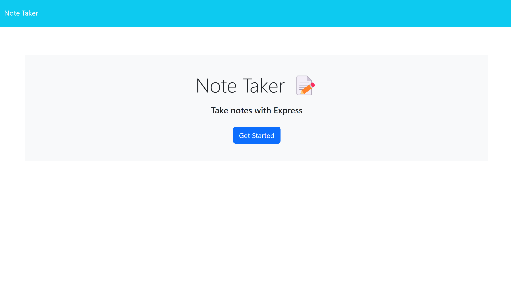
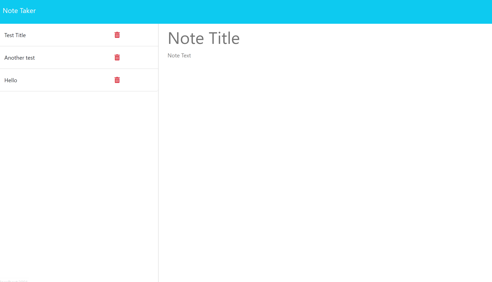

# Note Taker
  
  ## Description

  This is an application that helps to keep track of simple notes.

  Github Repository : https://github.com/yordanop/notices-premises-guarded

  Deployed application : https://note-taker-cyfo.onrender.com/

  ## Questions

  My email : yordanopv@gmail.com
  
  My Github page : https://github.com/yordanop

## Credits
Modules 7-10 from Bootcamp TDM-VIRT-FSF-PT-03-2024-U-LOLC-MTTH. Special thanks to our instructor Chris Stallcup and TA Brittani Court for the support and advice provided.

## License

   [MIT](https://choosealicense.com/licenses/mit/)

  